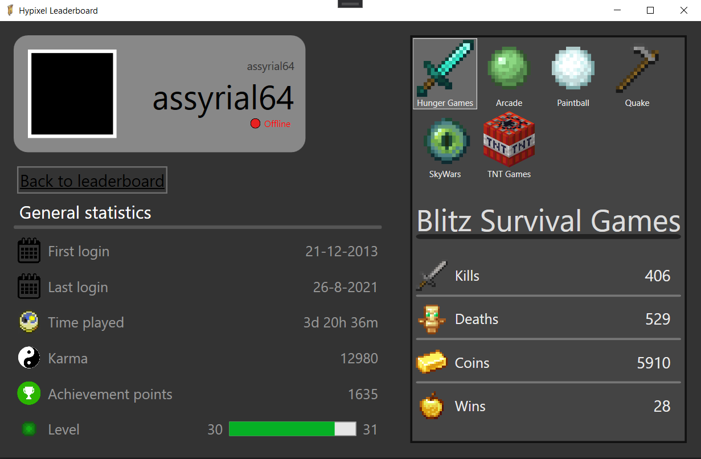

# project-DeRidderJonas

used api: Hypixel API
https://api.hypixel.net/

This api delivers information about the minigames people can play on this [minecraft server](https://hypixel.net/).
It can tell you how much time an account has been online, what games they have played and their statistics in each of those games.

To switch between Online web API or local Json file: in [MainViewModel.cs](ViewModel/MainViewModel.cs), toggle comments on lines 15 and 16.
